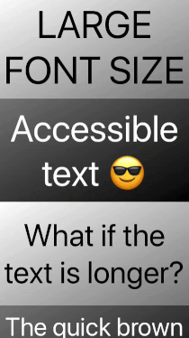

# AccessibilityKit ♿️

## MaxFontTextView 🚀

MaxFontTextView is a text view that automatically uses the largest possible font size, _spanning multiple lines as needed_. It's great for when you need some text or label to be as visually accessible as possible, or just generally more appealing.

You can also use all attributes of NSAttributableString as well as a built-in vertical alignment option. The text will always be efficiently rendered as large as possible within the bounds of the view:

 

## Why?

- UILabel's `adjustsFontSizeToFitWidth` doesn't play nice with multiple lines.
- UITextView doesn't have `adjustsFontSizeToFitWidth`.
- Other solutions might render some text incorrectly.
- Other solutions don't support attributable strings.
- Other solutions are slow.
- 😠😤😩

## Usage

```
let textView = MaxFontTextView()

// Use a simple or fancy NSAttributableString
textView.attributedText = .init(string: "Some text here", attributes: [.foregroundColor: UIColor.black])

// Easily align vertically: top, center or bottom
textView.verticalAlignment = .center

```

## That's it!

# 👏
